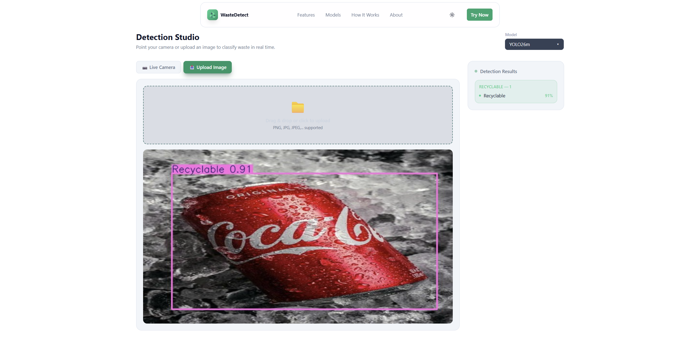

# Waste Detection (YOLO)

Ứng dụng phát hiện và phân loại rác thải bằng YOLO, gồm backend FastAPI và frontend React.

- Backend: FastAPI, OpenCV, Ultralytics YOLO, xử lý ảnh upload và stream webcam qua WebSocket.
- Frontend: React + Vite + TailwindCSS, hiển thị live camera, kết quả detection và FPS thực tế.
- Mô hình: tự động nhận các model có trong `weights/YOLO26x`, `weights/YOLO26m`, `weights/YOLO26s`, `weights/YOLO26n`.

**Dataset:** [Waste Detection Dataset on Roboflow](https://app.roboflow.com/wastedetection-1zidy/waste-detection-vqkjo-dkcrc/3)

## 1. Yêu cầu hệ thống

- Python 3.10+
- Node.js 18+
- Webcam nếu dùng chế độ live camera.
- GPU NVIDIA là tùy chọn, nhưng được khuyến nghị nếu muốn tăng tốc inference.

## 2. Cài đặt Backend

Mở terminal tại thư mục gốc project:

```powershell
python -m venv .venv
.\.venv\Scripts\activate
python -m pip install --upgrade pip
python -m pip install -r backend\requirements.txt
```

Nếu muốn chạy bằng GPU NVIDIA, cài PyTorch bản CUDA vào đúng `.venv`:

```powershell
python -m pip install --upgrade --force-reinstall torch torchvision --index-url https://download.pytorch.org/whl/cu130
```

Kiểm tra CUDA:

```powershell
python -c "import torch; print(torch.__version__); print(torch.cuda.is_available()); print(torch.cuda.get_device_name(0) if torch.cuda.is_available() else 'CPU')"
```

Chạy backend:

```powershell
cd backend
python -m uvicorn main:app --reload --port 8000
```

Khi model được load, backend sẽ in thiết bị đang dùng, ví dụ:

```text
Using YOLO device: cuda:0
```

## 3. Cài đặt Frontend

Mở terminal tại thư mục `frontend/`:

```powershell
cd frontend
npm install
npm run dev
```

Mặc định frontend kết nối tới backend tại `http://localhost:8000` và WebSocket tại `ws://localhost:8000`. Có thể chỉnh bằng biến môi trường Vite:

```powershell
$env:VITE_API_URL="http://localhost:8000"
$env:VITE_WS_URL="ws://localhost:8000"
npm run dev
```

## 4. Cấu hình chính

Các cấu hình backend nằm trong `backend/settings.py`:

- `WEBCAM_PATH`: nguồn webcam, mặc định là `0`.
- `INFERENCE_DEVICE`: mặc định `auto`, tự dùng `cuda:0` nếu PyTorch thấy GPU, ngược lại dùng `cpu`.
- `MODELS`: tự quét các file `best.pt` trong thư mục `weights/`.

Có thể ép thiết bị inference bằng biến môi trường:

```powershell
$env:YOLO_DEVICE="cuda:0"  # ép dùng GPU đầu tiên
$env:YOLO_DEVICE="cpu"     # ép dùng CPU
```

## 5. FPS

FPS hiển thị trên web là FPS thực tế của pipeline stream, được đo sau khi backend đọc frame, chạy YOLO, vẽ kết quả, encode JPEG và gửi qua WebSocket. Giá trị này có thể thấp hơn FPS danh nghĩa của webcam.

Một số yếu tố ảnh hưởng FPS:

- Model lớn hay nhỏ (`YOLO26n` thường nhanh hơn `YOLO26m`, `YOLO26s`, `YOLO26x`).
- Backend đang chạy GPU hay CPU.
- Độ phân giải webcam.
- Thời gian vẽ annotation và encode ảnh.

Câu mô tả phù hợp khi báo cáo kết quả:

> Bảng dưới đây trình bày tốc độ xử lý, tính theo FPS, của các mô hình khi thử nghiệm trên máy tính cá nhân.

## 6. Sử dụng

1. Chạy backend trên port `8000`.
2. Chạy frontend bằng `npm run dev`.
3. Mở URL Vite hiển thị trong terminal.
4. Chọn model và dùng tab live camera hoặc upload ảnh.
5. Xem ảnh đã gắn nhãn, danh sách detection và FPS thực tế.

## 7. Cấu trúc project

```text
backend/
  main.py          API image detect và WebSocket video stream
  detector.py      Wrapper YOLO, chọn CPU/GPU và xử lý detection
  settings.py      Cấu hình model, webcam, device

frontend/
  src/App.jsx
  src/components/VideoStream.jsx
  src/components/ImageUpload.jsx
  src/components/DetectionResults.jsx
  src/components/ModelSelector.jsx

weights/
  YOLO26x/best.pt
  YOLO26m/best.pt
  YOLO26s/best.pt
  YOLO26n/best.pt
```

## 8. Hình ảnh minh họa



## 9. Ghi chú

- Thư mục `weights/` có dung lượng lớn; nếu clone project chưa có model, cần thêm file `best.pt` tương ứng.
- Nếu lệnh `uvicorn` bị lỗi launcher sau khi di chuyển project, dùng `python -m uvicorn main:app --reload --port 8000`.
- Nếu `torch.cuda.is_available()` trả về `False`, backend vẫn chạy được bằng CPU nhưng FPS sẽ thấp hơn đáng kể.
